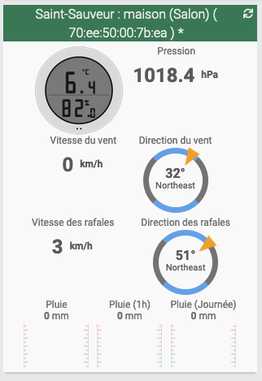

# Description
Plugin permettant de récupérer les relevés météo des stations Netatmo (même si vous n'en possedez pas vous-même !). Le choix des stations à récupérer se fait à partir de **vos stations météo favorites** de votre compte (gratuit) Netatmo. Création et gestion sur [https://weathermap.netatmo.com](https://weathermap.netatmo.com)

# Pré-requis 
- Avoir un compte (gratuit) sur [https://weathermap.netatmo.com](https://weathermap.netatmo.com) 
- Avoir de 1 à 5 stations météo, ajoutée(s) en favoris
- Avoir un Jeedom :-) 

# Configuration

## Liaison entre Jeedom <> Netatmo
Une fois le plugin installée, allez dans la page de Configuration du plugin (Icône "Configuration"). 2 choix s'offre à vous pour récupérer les données de vos stations favorites. 

### Méthode : "L'application hébergée" (simple)
Clique sur le bouton `J'autorise l'application à l'accès mes stations favorites Netatmo` pour autoriser l'application hébergée NetatmoPublicData a récupérer les `tokens`. 

Une nouvelle fenêtre s'ouvre, vous autorisez l'application Netatmo, puis vous verrez l'icône : ✅

### Méthode : "Ton application" (expert)
Votre Jeedom doit avoir un accès externe configuré. 
Vous devez posséder un `client_id` et un `client_secret` généré sur le site [https://dev.netatmo.com](https://dev.netatmo.com).

Pour cela, vous devez créer votre application (gratuit) : [https://dev.netatmo.com/apps/createanapp#form](https://dev.netatmo.com/apps/createanapp#form)

Une fois le plugin installé, il vous faut renseigner vos informations de connexion Netatmo :

- `Client ID` : votre client ID
- `Client secret` : votre client secret

Puis cliquer sur `Association Netatmo` pour lier votre compte.

##Tester la liaison
Toujours dans la page de Configuration, vous avez le `Statut` de la laison : `OK` ou `NOK`. Des actions sont possibles selon les statuts :

- `NOK` vous pouvez `Tester la liasion` qui tente une récupération des `tokens`. 
- `OK`, vous pouvez `Débrancher` pour supprimer les `tokens` mémorisés.

Dans le plugin, le boutton `Synchroniser` : permet à votre Jeedom de découvrir automatiquement vos stations "favorites" Netatmo, les votres ou celles de vos voisins. A faire après avoir sauvegardé les paramètres précédents.

# FAQ
- Quelle est la différence entre la méthode "L'application hébergée" et la version "Ton application" ?
>Dans les 2 méthodes, les données des stations sont récupérées directement chez Netatmo. (Votre Jeedom > serveur de Netatmo). 
>- La version "Ton application" requière la configuration d'un `Client ID`, d'un `Client secret` et un accès externe à Jeedom. Les flux des données sont uniquement entre Jeedom et les serveurs de Netatmo.  Ceci est la méthode initial de configuration.
>- La version "L'application hébergée" s'appuie sur une application unique hébergée pour obtenir les `tokens` d'accès. Mon serveur stocke ces `tokens` et permet de les renouveler automatiquement pour vous. Aucune donnéee liées à vos stations, aucune donnée personnelle transittent ici.

- Puis-je changer de méthode de connexion sans permettre mes stations ?
>Oui. Vous pouvez changer de méthode comme vous voulez. Aucun impact sur vos Stations (Equipement) crées et configurées. 

- Est-ce que le plugin s'appuie sur des API tiers ?
>Oui, le plugin utilise les API de Netatmo pour récupérer les données de vos stations météo favorites

- Quel est le délai de mise à jour ? 
> Toutes les 15 minutes, par la tâche Cron Jeedom. 

- Où puis-je gérer (ajouter / supprimer) des stations météos ? 
> Uniquement depuis [https://weathermap.netatmo.com](https://weathermap.netatmo.com) . Une fois connecté, vous pouvez mettre des stations dans vos *favoris*. 
>Lancer une synchronisation, et les équipements sont crées (actif + visible). 

- Si je supprime une station météo de mes *favoris* sur le site Netatmo, que se passe-t-il ? 
> Au prochain lancement de la "Synchronisation" (manuelle), l'Équipement est *désactivé*, mais reste présent dans Jeedom. Vous pouvez le supprimer manuellement.   

- Pourquoi il y une "étoile" (*) en préfix du nom de la station ?  
> Le nom initial de l'Équipmenet est une concaténation  : 'Nom de la ville' + 'petite nom donnée par le propriétaire' + '*' afin d'indiquer que c'est le nom depuis Netatmo. 
>Vous pouvez renommer vos équipements, votre nom sera conservé lors de la prochaine Synchronisation.   

- Vous avez un bug JS 'Uncaught TypeError: cmd.find(…).delay(…).animate is not a function' ? 
> Ce plugin utilise le widget Rain (natif à Jeedom v4). Mais certains autres plugins rentrent en conflit avec ce nouveau widget. 
> Solution : mettre à jour vos plugins (ex : 'horlogehtc', etc.)

- Les données ne remontent pas automatiquement ? Malgrès l'activation du cron15
> Il y a un conflit (de chargement de dépendance technique) avec d'autres plugins comme NetatmoPro. 
> Solution : mettre à jour vos plugins (ex : 'NetatmoPro', etc.). 
 

# Exemple

## Dashboard (Widgets natifs v4)

## Equipements

## Commandes

